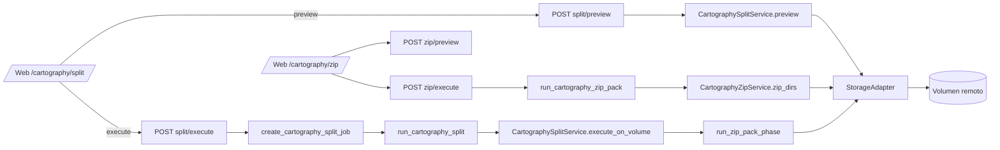

# Cartography — División de directorio por pozo (`cartography-maps-split`)

## Objetivo

El equipo de cartografía recibe un único directorio con archivos **PDF** y **MXD** mezclados de múltiples pozos petroleros, más una subcarpeta **SHP/** compartida. El proceso manual de separar esos archivos en carpetas individuales por pozo es repetitivo y propenso a errores.

Este flujo automatiza esa división sobre un volumen remoto configurado (SMB/SFTP/NFS/FTP), siguiendo el mismo patrón que las rutinas GYG (`fallas-split`, `horizontes-split`): **Preview síncrono + Execute asíncrono vía Celery job**.

La lógica vive en [`CartographySplitService`](../../apps/api/modules/cartography/service.py). Celery solo crea el job, pasa a RUNNING y delega en el servicio. La UI vive en `/cartography/split` (no en `/gyg`) y reutiliza `DirectoryExplorerPanel` como explorador de volumen.

## Contrato de entrada

### Nombre del directorio fuente

```
MAPA_LOC_DIST_LINDERO_TRAYECTORIA_<WELL>_<NCR>_MNal
```

- **WELL**: identificador del pozo dueño (p. ej. `RUBIALES1747H`, `APIAY2415`).
- **NCR**: designación CR (p. ej. `4CR`, `6CR`).

Regex (case-insensitive):

```
^MAPA_LOC_DIST_LINDERO_TRAYECTORIA_([A-Z0-9]+)_(\d+CR)_MNal$
```

Si el nombre del directorio fuente no matchea, el job falla con `VALIDATION_ERROR`.

### Nombre de los archivos individuales

Dos variantes soportadas, ambas case-insensitive:

```
Loc_dist_Survey_<WELL>_<NCR>_MNal_SGC.(pdf|mxd)
Loc_dist_<WELL>_<NCR>_MNal_SGC.(pdf|mxd)
```

Regex:

```
^Loc_dist(?:_Survey)?_([A-Z0-9]+)_(\d+CR)_MNal_SGC\.(pdf|mxd)$
```

Archivos que no matchean se listan como `unmatchedFiles` y **no se tocan** durante el execute (quedan en el directorio fuente).

### Subcarpeta SHP

Cualquier directorio cuyo nombre sea `SHP` (case-insensitive) directamente bajo el source se considera la subcarpeta a copiar a cada nueva carpeta. El contenido del SHP no se examina ni se modifica — se copia **recursivamente tal cual**.

## Lógica de división

Dado:

- `sourcePath`: directorio fuente (debe matchear el regex del nombre de directorio).
- `destPath`: directorio destino donde se crearán las carpetas nuevas. Debe existir dentro del volumen (se crea automáticamente si no existe) y **no puede** ser igual al source ni un descendiente suyo.

El pozo **dueño** se deduce del nombre de la carpeta fuente.

**Fase 1 — split**

- Para cada pozo **ajeno** al dueño detectado en los archivos:
  1. Crear `{destPath}/MAPA_LOC_DIST_LINDERO_TRAYECTORIA_<WELL>_<NCR>_MNal`.
  2. **Mover** (rename nativo del adapter) el PDF y el MXD de ese pozo desde el source al nuevo directorio.
  3. **Copiar** la subcarpeta `SHP/` completa desde el source al nuevo directorio (`adapter.copy` recursivo).
- **Dueño:** al finalizar los movimientos ajenos, el directorio fuente completo se **renombra** a
  `{destPath}/MAPA_LOC_DIST_LINDERO_TRAYECTORIA_<WELL_dueño>_<NCR>_MNal` (mismo nombre canónico).
  Si el source ya coincide con esa ruta (fuente ya bajo `destPath`), el paso es **no-op**.
- Archivos no matcheados viajan con la carpeta del dueño al renombrar el directorio.

**Fase 2 — ZIP (mismo job de split)**

- Tras el split, se detecta el **primer** directorio `*.gdb` (case-insensitive) directamente bajo `destPath`.
- Por cada carpeta `MAPA_*_MNal` presente en el plan (dueño incluido), se genera `{nombreCarpeta}.zip` en `destPath`
  con el árbol de esa carpeta + el árbol del `.gdb`. El `.gdb` **no se modifica**.
- Streaming: `download_file` por chunks → `zipfile.ZipFile` en archivo temporal local → `upload_file(bytes)` al volumen.
- Si falta GDB: warning en preview y cada ZIP falla con `NO_GDB_FOUND` sin abortar el job de split.
- Si un `.zip` destino ya existe: ese ítem falla (`Already exists`); los demás continúan.



## Endpoints

### `POST /api/v1/cartography/split/preview`

Plan síncrono, **no muta el volumen**. Lee el directorio fuente, agrupa por pozo y devuelve el plan propuesto junto con conflictos detectados.

**Body:**

```json
{
  "volumeId": "UUID",
  "sourcePath": "/cartografia/MAPA_LOC_DIST_LINDERO_TRAYECTORIA_RUBIALES1747H_4CR_MNal",
  "destPath": "/cartografia/output"
}
```

**Response (`200 OK`):**

```json
{
  "sourcePath": "...",
  "destPath": "...",
  "sourceDirName": "MAPA_LOC_DIST_...",
  "ownerWell": { "well": "RUBIALES1747H", "cr": "4CR" },
  "detectedWells": [
    {
      "well": "RUBIALES1747H",
      "cr": "4CR",
      "isOwner": true,
      "newDirName": "MAPA_LOC_DIST_LINDERO_TRAYECTORIA_RUBIALES1747H_4CR_MNal",
      "targetDirPath": "/cartografia/output/MAPA_LOC_DIST_LINDERO_TRAYECTORIA_RUBIALES1747H_4CR_MNal",
      "files": [
        { "name": "Loc_dist_Survey_RUBIALES1747H_4CR_MNal_SGC.pdf", "extension": "pdf" },
        { "name": "Loc_dist_Survey_RUBIALES1747H_4CR_MNal_SGC.mxd", "extension": "mxd" }
      ],
      "willMove": true
    }
  ],
  "shpFolders": ["SHP"],
  "unmatchedFiles": [],
  "conflicts": [],
  "gdbFound": "Base_Rubiales.gdb",
  "zipsToCreate": ["MAPA_....zip", "..."],
  "warnings": [],
  "summary": {
    "newDirsToCreate": 3,
    "filesToMove": 6,
    "shpCopiesPlanned": 3,
    "zipsPlanned": 4,
    "ownerDirWillMove": true
  }
}
```

### `POST /api/v1/cartography/split/execute`

Crea un `Job` (tabla `jobs`) y lo encola en Celery. Antes de encolar, ejecuta el preview para validar el nombre del directorio y detectar conflictos obvios (fail-fast HTTP).

**Body:**

```json
{
  "volumeId": "UUID",
  "sourcePath": "...",
  "destPath": "...",
  "overwriteExisting": false
}
```

**Response (`202 Accepted`):**

```json
{ "jobId": "UUID", "taskId": "celery-task-id", "status": "pending" }
```

El seguimiento del job es el patrón estándar en `/jobs/{id}`.

### `POST /api/v1/cartography/zip/preview` y `POST /api/v1/cartography/zip/execute`

Flujo **manual** para repetir solo la fase ZIP (sin split). Valida que `gdbPath` termine en `.gdb`, que cada ruta en `dirsToZip` exista y sea directorio, y reporta conflictos si ya existe el `.zip` homónimo bajo `destPath`.

**Body (preview / execute):**

```json
{
  "volumeId": "UUID",
  "destPath": "/cartografia/output",
  "gdbPath": "/cartografia/output/Base_Rubiales.gdb",
  "dirsToZip": [
    "/cartografia/output/MAPA_LOC_DIST_LINDERO_TRAYECTORIA_RUBIALES1747H_4CR_MNal"
  ],
  "overwriteExisting": false
}
```

Execute (`202`) crea un job con `executionMode = "cartography_zip_pack"` y la tarea Celery `run_cartography_zip_pack` delega en `CartographyZipService.zip_dirs` (misma lógica de empaquetado que la fase 2 del split).

## Errores

| Caso                                                   | HTTP / Job                                                          | Código                      |
| ------------------------------------------------------ | ------------------------------------------------------------------- | --------------------------- |
| `sourcePath` fuera del `sharePath` o inexistente       | `400` (preview/execute) / FAILURE                                   | `VALIDATION_ERROR`          |
| Nombre del directorio fuente no matchea regex          | `400`                                                               | `VALIDATION_ERROR`          |
| `destPath` es el source o un descendiente              | `400`                                                               | `VALIDATION_ERROR`          |
| `destPath` ya contiene una carpeta con el mismo nombre | Preview lo reporta en `conflicts`; execute `409` / FAILURE sin overwrite | `OUTPUT_CONFLICT`           |
| Archivo que no matchea el regex                        | Se ignora; aparece en `unmatchedFiles`                              | —                           |
| Fallo parcial a mitad del execute                      | Job FAILURE con `result.partialSuccess`                             | `CARTOGRAPHY_SPLIT_ERROR`   |
| Volumen inactivo / red                                 | FAILURE                                                             | `CARTOGRAPHY_SPLIT_ERROR`   |

Con `overwriteExisting=true`, las carpetas destino en conflicto se **borran antes** de la nueva creación (`adapter.delete` recursivo + `adapter.create_folder` + mover archivos + copiar SHP).

## Resultado del job (`job.result`)

```json
{
  "service": "cartography_maps_split",
  "ownerWell": { "well": "RUBIALES1747H", "cr": "4CR" },
  "sourcePath": "...",
  "destPath": "...",
  "createdDirs": ["..."],
  "movedFiles": [
    { "well": "...", "cr": "...", "name": "...", "from": "...", "to": "..." }
  ],
  "shpCopies": [
    { "well": "...", "cr": "...", "from": "...", "to": "..." }
  ],
  "unmatchedFiles": [],
  "ownerDirMovedTo": "/cartografia/output/MAPA_..._RUBIALES1747H_4CR_MNal",
  "gdbUsed": "Base_Rubiales.gdb",
  "zipResults": [
    {
      "zipName": "MAPA_....zip",
      "path": "/cartografia/output/MAPA_....zip",
      "status": "ok",
      "message": "",
      "sizeBytes": 123456
    }
  ],
  "summary": {
    "newDirsCreated": 3,
    "filesMoved": 6,
    "shpCopiesDone": 3,
    "zipsOk": 4,
    "zipsTotal": 4
  },
  "stdout": "...",
  "stderr": ""
}
```

Si el job falla a mitad de la operación, `result.partialSuccess` lista qué se alcanzó a mover antes del error.

## Operativa

1. El router `cartography_router` se registra en [`apps/api/main.py`](../../apps/api/main.py) bajo `/api/v1`.
2. La UI vive en `/cartography/split` y `/cartography/zip` (sidebar [`apps/web/lib/nav.ts`](../../apps/web/lib/nav.ts)).
3. Celery: `run_cartography_split` y `run_cartography_zip_pack` en [`apps/api/modules/jobs/tasks.py`](../../apps/api/modules/jobs/tasks.py). No usan tabla `routines`; el payload trae `executionMode`.
4. Helpers: `create_cartography_split_job` en [`service.py`](../../apps/api/modules/cartography/service.py); `create_cartography_zip_job` en [`zip_service.py`](../../apps/api/modules/cartography/zip_service.py).

## Ejemplo concreto

**Source:** `/cartografia/MAPA_LOC_DIST_LINDERO_TRAYECTORIA_RUBIALES1747H_4CR_MNal` (con archivos de 4 pozos + SHP).
**Destino:** `/cartografia/output` (con `Base_Rubiales.gdb` ya presente en ese directorio).

Resultado esperado tras el job:

- Cuatro carpetas `MAPA_LOC_DIST_LINDERO_TRAYECTORIA_<pozo>_4CR_MNal` bajo `/cartografia/output` (incluida la del dueño, movida desde el source).
- Cuatro archivos `.zip` homónimos (cada ZIP contiene una carpeta MAPA + el árbol del `.gdb`).
- El directorio `Base_Rubiales.gdb` permanece intacto en `/cartografia/output`.
- El directorio fuente original bajo `/cartografia/` deja de existir (todo el árbol del dueño se renombró al destino).

## Tests

[`apps/api/tests/test_cartography_split.py`](../../apps/api/tests/test_cartography_split.py):

- **Parser** (unitario): ambos patrones con/sin `_Survey_`, case-insensitive, rechazo de nombres inválidos.
- **Preview**: fixture con 4 pozos (1 dueño + 3 ajenos), summary numérico exacto, `shpFolders = ["SHP"]`, `unmatchedFiles` vacío por defecto; detección de archivos no matcheados; rechazo de source name inválido y de dest dentro del source; reporte de conflictos.
- **Execute**: happy path — dueño movido a dest, 4 ZIPs con MAPA+GDB, `download_file`/`upload_file`; sin GDB → `zipResults` con `NO_GDB_FOUND`; ZIP preexistente → error en ese ítem y el resto OK; dueño ya en ruta canónica → no-op de rename.
- **ZIP manual**: `CartographyZipService.zip_dirs` con `InMemoryAdapter` y monkeypatch en `zip_service`.

El adapter en memoria implementa `BaseStorageAdapter` (incl. streaming por chunks en `download_file`) y hace `monkeypatch` de `get_volume_by_id` y `get_adapter`, evitando red o volumen real.

## Fuera de alcance (posibles siguientes)

- Soporte cross-volume (source y dest en volúmenes distintos): requiere copy+delete con streaming.
- Deshacer / rollback automático si el execute falla a mitad.
- Auditoría dedicada de cartografía (hoy se loguea vía `loguru`; no se crean entidades BD nuevas).
